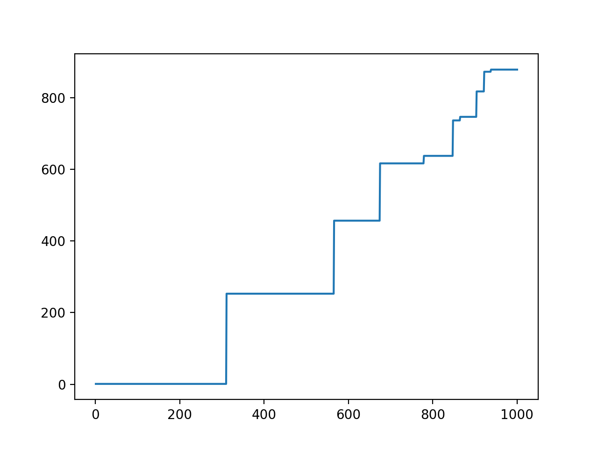

## Random R = 1000 p = 0.01 n = 1000

```
There was never a round where only one node mined
total number of blocks mined:  10193
number of blocks in consensus:  982
percentage discarded:  0.9036593740802512
```


## Random R = 1000 p = 0.001 n = 1000

```
average number of rounds it takes until only one node mines:  2.6455026455026456
total number of blocks mined:  1014
number of blocks in consensus:  639
percentage discarded:  0.3698224852071006
```


## First seen R = 1000 p = 0.01 n = 1000

```
average number of rounds it takes until only one node mines:  1000.0
total number of blocks mined:  10036
number of blocks in consensus:  987
percentage discarded:  0.9016540454364288
```


## First seen R = 1000 p = 0.001 n = 1000

```
average number of rounds it takes until only one node mines:  2.7247956403269753
total number of blocks mined:  980
number of blocks in consensus:  619
percentage discarded:  0.3683673469387755
```


## Random R = 1000 p = 0.1 n = 1000

```
There was never a round where only one node mined
total number of blocks mined:  99503
number of blocks in consensus:  879
percentage discarded:  0.9911660954946082
```




## First seen R = 1000 p = 0.1 n = 1000

```
There was never a round where only one node mined
total number of blocks mined:  99986
number of blocks in consensus:  778
percentage discarded:  0.9922189106474907
```


- p in practice?
  - 1 block / 10 min
  - 2^70 hashes / 10 min


- benefit of random choice
  - smaller and more frequent jumps?

