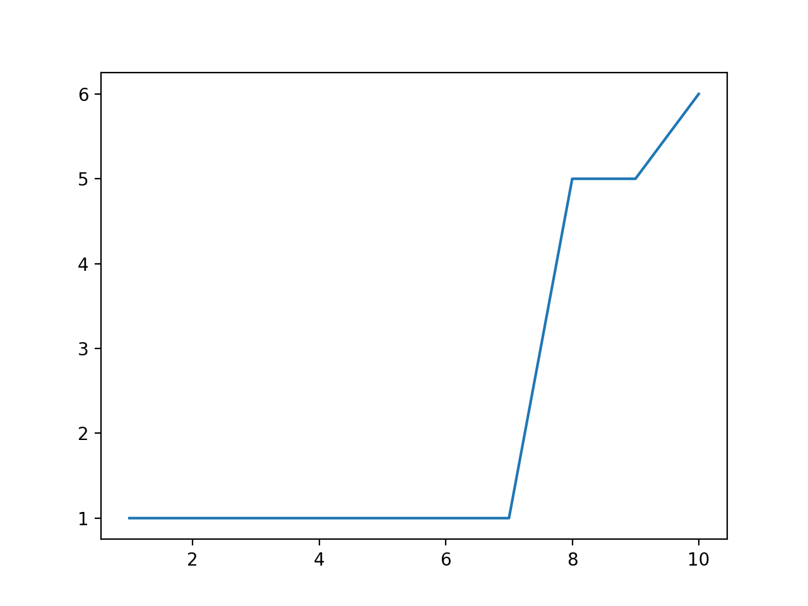
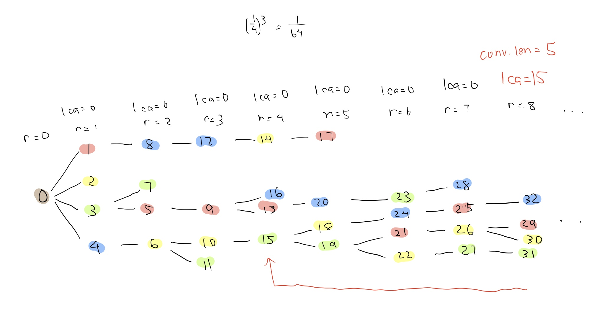

MAX_ROUNDS = 10
p = 1
n = 4



```
round 1
{1: 0, 2: 1}
{1: 0, 2: 2}
{1: 0, 2: 3}
{1: 0, 2: 4}

round 2
{1: 0, 2: 3, 3: 5}
{1: 0, 2: 4, 3: 6}
{1: 0, 2: 3, 3: 7}
{1: 0, 2: 1, 3: 8}

round 3
{1: 0, 2: 3, 3: 5, 4: 9}
{1: 0, 2: 4, 3: 6, 4: 10}
{1: 0, 2: 4, 3: 6, 4: 11}
{1: 0, 2: 1, 3: 8, 4: 12}

round 4
{1: 0, 2: 3, 3: 5, 4: 9, 5: 13}
{1: 0, 2: 1, 3: 8, 4: 12, 5: 14}
{1: 0, 2: 4, 3: 6, 4: 10, 5: 15}
{1: 0, 2: 3, 3: 5, 4: 9, 5: 16}

round 5
{1: 0, 2: 1, 3: 8, 4: 12, 5: 14, 6: 17}
{1: 0, 2: 4, 3: 6, 4: 10, 5: 15, 6: 18}
{1: 0, 2: 4, 3: 6, 4: 10, 5: 15, 6: 19}
{1: 0, 2: 3, 3: 5, 4: 9, 5: 13, 6: 20}

round 6
{1: 0, 2: 4, 3: 6, 4: 10, 5: 15, 6: 19, 7: 21}
{1: 0, 2: 4, 3: 6, 4: 10, 5: 15, 6: 19, 7: 22}
{1: 0, 2: 3, 3: 5, 4: 9, 5: 13, 6: 20, 7: 23}
{1: 0, 2: 4, 3: 6, 4: 10, 5: 15, 6: 18, 7: 24}

round 7
{1: 0, 2: 4, 3: 6, 4: 10, 5: 15, 6: 18, 7: 24, 8: 25}
{1: 0, 2: 4, 3: 6, 4: 10, 5: 15, 6: 19, 7: 21, 8: 26}
{1: 0, 2: 4, 3: 6, 4: 10, 5: 15, 6: 19, 7: 22, 8: 27}
{1: 0, 2: 3, 3: 5, 4: 9, 5: 13, 6: 20, 7: 23, 8: 28}

height 2
{1: 0, 2: 4, 3: 6, 4: 10, 5: 15, 6: 19, 7: 21, 8: 26}
{1: 0, 2: 4, 3: 6, 4: 10, 5: 15, 6: 19, 7: 21, 8: 26}
{1: 0, 2: 4, 3: 6, 4: 10, 5: 15, 6: 19, 7: 22, 8: 27}
{1: 0, 2: 4, 3: 6, 4: 10, 5: 15, 6: 18, 7: 24, 8: 25}
height 3
{1: 0, 2: 4, 3: 6, 4: 10, 5: 15, 6: 19, 7: 21, 8: 26}
{1: 0, 2: 4, 3: 6, 4: 10, 5: 15, 6: 19, 7: 21, 8: 26}
{1: 0, 2: 4, 3: 6, 4: 10, 5: 15, 6: 19, 7: 22, 8: 27}
{1: 0, 2: 4, 3: 6, 4: 10, 5: 15, 6: 18, 7: 24, 8: 25}
height 4
{1: 0, 2: 4, 3: 6, 4: 10, 5: 15, 6: 19, 7: 21, 8: 26}
{1: 0, 2: 4, 3: 6, 4: 10, 5: 15, 6: 19, 7: 21, 8: 26}
{1: 0, 2: 4, 3: 6, 4: 10, 5: 15, 6: 19, 7: 22, 8: 27}
{1: 0, 2: 4, 3: 6, 4: 10, 5: 15, 6: 18, 7: 24, 8: 25}
height 5
{1: 0, 2: 4, 3: 6, 4: 10, 5: 15, 6: 19, 7: 21, 8: 26}
{1: 0, 2: 4, 3: 6, 4: 10, 5: 15, 6: 19, 7: 21, 8: 26}
{1: 0, 2: 4, 3: 6, 4: 10, 5: 15, 6: 19, 7: 22, 8: 27}
{1: 0, 2: 4, 3: 6, 4: 10, 5: 15, 6: 18, 7: 24, 8: 25}
round 8
{1: 0, 2: 4, 3: 6, 4: 10, 5: 15, 6: 19, 7: 21, 8: 26, 9: 29}
{1: 0, 2: 4, 3: 6, 4: 10, 5: 15, 6: 19, 7: 21, 8: 26, 9: 30}
{1: 0, 2: 4, 3: 6, 4: 10, 5: 15, 6: 19, 7: 22, 8: 27, 9: 31}
{1: 0, 2: 4, 3: 6, 4: 10, 5: 15, 6: 18, 7: 24, 8: 25, 9: 32}

round 9
{1: 0, 2: 4, 3: 6, 4: 10, 5: 15, 6: 18, 7: 24, 8: 25, 9: 32, 10: 33}
{1: 0, 2: 4, 3: 6, 4: 10, 5: 15, 6: 19, 7: 22, 8: 27, 9: 31, 10: 34}
{1: 0, 2: 4, 3: 6, 4: 10, 5: 15, 6: 19, 7: 21, 8: 26, 9: 30, 10: 35}
{1: 0, 2: 4, 3: 6, 4: 10, 5: 15, 6: 19, 7: 21, 8: 26, 9: 30, 10: 36}

height 6
{1: 0, 2: 4, 3: 6, 4: 10, 5: 15, 6: 19, 7: 21, 8: 26, 9: 30, 10: 35}
{1: 0, 2: 4, 3: 6, 4: 10, 5: 15, 6: 19, 7: 22, 8: 27, 9: 31, 10: 34}
{1: 0, 2: 4, 3: 6, 4: 10, 5: 15, 6: 19, 7: 22, 8: 27, 9: 31, 10: 34}
{1: 0, 2: 4, 3: 6, 4: 10, 5: 15, 6: 19, 7: 21, 8: 26, 9: 30, 10: 36}
round 10
{1: 0, 2: 4, 3: 6, 4: 10, 5: 15, 6: 19, 7: 21, 8: 26, 9: 30, 10: 35, 11: 37}
{1: 0, 2: 4, 3: 6, 4: 10, 5: 15, 6: 19, 7: 22, 8: 27, 9: 31, 10: 34, 11: 38}
{1: 0, 2: 4, 3: 6, 4: 10, 5: 15, 6: 19, 7: 22, 8: 27, 9: 31, 10: 34, 11: 39}
{1: 0, 2: 4, 3: 6, 4: 10, 5: 15, 6: 19, 7: 21, 8: 26, 9: 30, 10: 36, 11: 40}

There was never a round where only one node mined
total number of blocks mined:  41
number of blocks in consensus:  6
percentage discarded:  0.8536585365853658
```


What happened?



